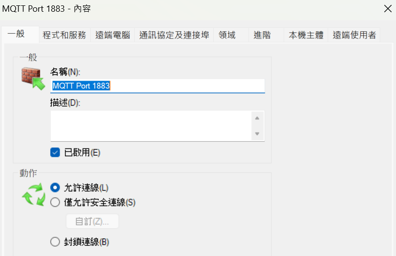
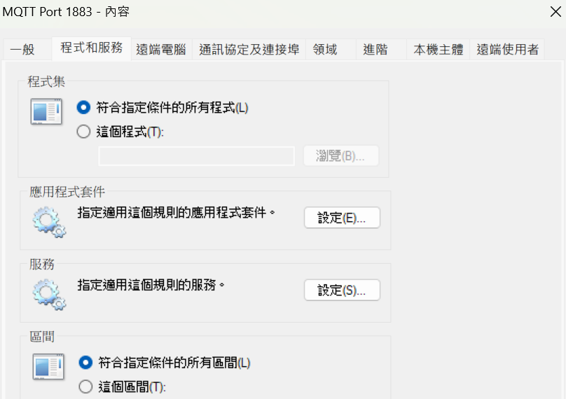
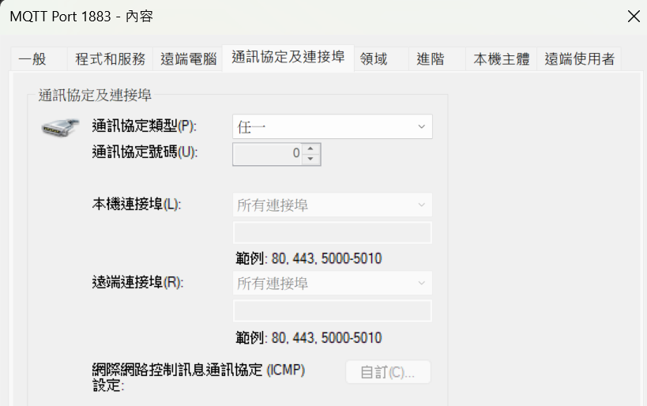
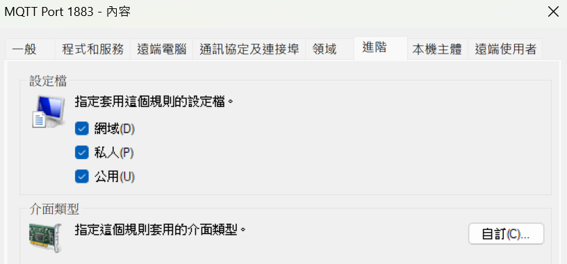
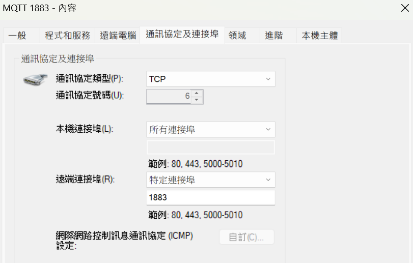
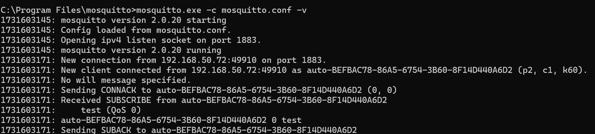

> # **Change WIFI, Password, Server's IP before you test MQTT.**

# How to setup MQTT on your PC

The following instructions show how to setup mqtt broker on your pc.

- Install mqtt broker -- mosquitto
- Set path - environment variable
- modified mosquitto.conf
- Firewall: add both input and output rules
- Setup Server
- Start publish and subscribe!

# Set path - environment variable

[Install Mosquitto MQTT Windows - donskytech.com](https://www.donskytech.com/install-mosquitto-mqtt-windows/)

# modified mosquitto.conf

add this two lins:

```
allow_anonymous true
listener 1883 0.0.0.0
```

# Firewall: add both input and output rules

### input rule





### output rule



# setup broker server

run

```
C:\Program Files\mosquitto>mosquitto.exe -c mosquitto.conf -v
```

you should see something like



果沒有看到這個再運行 代表 broker server 有可能沒有在運作

# Start publish and subscribe!

1. setup broker server, record the server ip
2. publisher

   ```
   mosquitto_pub -h HOST_IP ip -t TOPIC -m MSG
   ```
3. subscriber

   ```
   mosquitto_sub -h HOST_IP -t TOPIC
   ```
